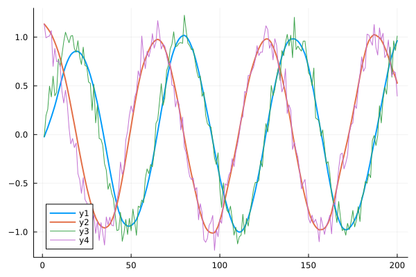
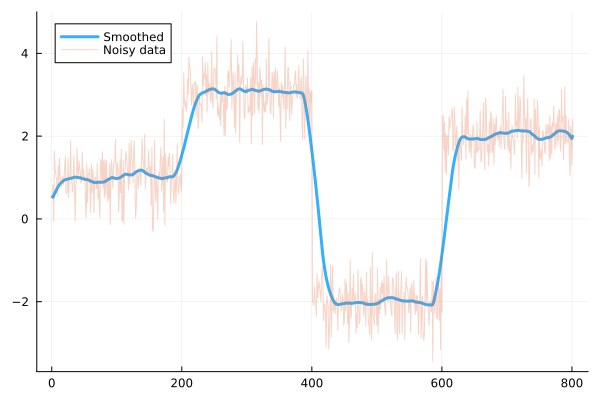
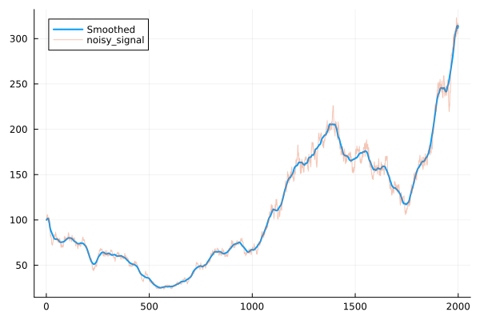

[](https://codecov.io/gh/MortezaBabazadehShareh/PIDSmoothing.jl)

## PIDSmoothing.jl

`PIDSmoothing.jl` is a Julia package that implements advanced smoothing techniques for noisy data using Proportional-Integral-Derivative (PID) control principles. This package is designed for both real-time and batch data processing, providing users with a powerful tool for enhancing data quality and analysis. With its flexibility and ease of use, `PIDSmoothing.jl` is ideal for a wide range of applications requiring precision in data smoothing.

## Quick Demonstration

```julia
##### an example for using PID with limited number of integrals #############################
    using PIDSmoothing
    using Plots
    using Random

    Random.seed!(0)
    x = range(0, stop=20, length=200)
    y = sin.(x) .+ randn(length(x)) .* 0.1

    kp = 0.1
    ki = 0.01
    kd = 0.01
    integral_limit = 3.0
    integral_length = 10
    adaptive_rate=0.01
    decay=0.2
    n_setpoint=5

    filtered = pid_smoothing(y, n_setpoint=n_setpoint,  ki=ki, kp=kp, kd=kd,
                    adaptive_rate=adaptive_rate, integral_limit=integral_limit, 
                    integral_length=integral_length, decay=decay,
                    neighbors_before=true, neighbors_after=true)

    plot(filtered, lw=2, label="Smoothed")   
    plot!(y, label="Noisy", alpha=0.8)
```

```julia
#### an example of batch smoothing with limited number of integrals ###########################
    using PIDSmoothing
    using Plots
    using Random


    Random.seed!(0)
    x = range(0, stop=20, length=200)
    y1 = sin.(x) .+ randn(length(x)) .* 0.1
    y2 = cos.(x) .+ randn(length(x)) .* 0.1
 
    y=[[y1];[y2]]
    plot(batch_pid_smoothing([Float32.(vec) for vec in y], n_setpoint=5, decay=0.2,
                             integral_length=10, integral_limit=2.0, adaptive_rate=0.001,
                             neighbors_before=false, neighbors_after=true), lw=2)
    plot!(y)
```


```julia
####################################### step signal example  ##############################
    using PIDSmoothing
    using Plots
    using Random

    Random.seed!(150)
    # Generate a step function signal
    function generate_step_function(t)
        signal = zeros(length(t))
        for i in eachindex(t)
            if t[i] < 2
                signal[i] = 1
            elseif t[i] < 4
                signal[i] = 3
            elseif t[i] < 6
                signal[i] = -2
            else
                signal[i] = 2
            end
        end
        return signal
    end

    # Generate time vector and step function signal
    t = 0:0.01:8
    step_signal = generate_step_function(t)

    # Add Gaussian noise
    noise = 0.5 * randn(length(t))
    noisy_step_signal = step_signal .+ noise

    
    y=noisy_step_signal
    kp = 0.1
    ki = 0.01
    kd = 0.01
    integral_limit =1.0
    integral_length=10
    adaptive_rate=0.0001
    n_setpoint=15
    decay=0.2

    plot(pid_smoothing(y,  n_setpoint=n_setpoint, ki=ki, kp=kp, kd=kd,
         adaptive_rate=adaptive_rate, integral_limit=integral_limit, 
         integral_length=integral_length, decay=decay,
         neighbors_before=true, neighbors_after=true), label="Smoothed",
         alpha=0.8, lw=3) #
       
    plot!(noisy_step_signal, alpha=0.3, label="Noisy data)
```

```julia
####################################### example of synthetic stock price signal ###################
    using Plots
    using PIDSmoothing
    using Random
    Random.seed!(850)

    # Function to generate a synthetic stock price signal
    function generate_stock_price_signal(N::Int; init_price::Float64 = 100.0, volatility::Float64 = 0.02, trend::Float64 = 0.001)
        prices = Vector{Float64}(undef, N)
        prices[1] = init_price
        
        for i in 2:N
            # Random noise simulating daily price fluctuation
            noise = volatility * randn()
            # Trend component (upwards or downwards)
            prices[i] = prices[i-1] * (1.0 + trend + noise)
        end
        
        return prices
    end

    # Parameters for the signal
    N = 2000  # Length of the signal
    init_price = 100.0  # Initial stock price
    volatility = 0.025  # Volatility factor
    trend = 0.001  # Overall trend

    # Generate the signal
    stock_price_signal = generate_stock_price_signal(N; init_price=init_price, volatility=volatility, trend=trend)

    y=stock_price_signal
    kp = 0.1
    ki = 0.01
    kd = 0.01
    integral_limit =2.0
    integral_length=10
    adaptive_rate=0.001
    n_setpoint=20
    decay=0.2

    PIDSmoothed=pid_smoothing(y ,n_setpoint=n_setpoint, 
                ki=ki, kp=kp, kd=kd, decay=decay,
                adaptive_rate=adaptive_rate, integral_limit=integral_limit, 
                integral_length=integral_length,
                neighbors_before=true, neighbors_after=true)

    start=1
    finish=2000
    plot(PIDSmoothed[start:finish], lw=2, alpha=1.0, label="Smoothed")
    
    plot!(y[start:finish], label="noisy_signal", alpha=0.4)       

end
```


