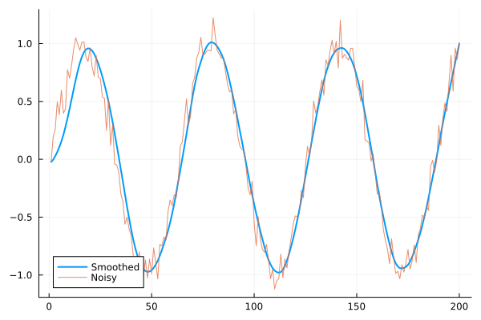

[](https://codecov.io/gh/MortezaBabazadehShareh/PIDSmoothing.jl)

## PIDSmoothing.jl

`PIDSmoothing.jl` is a Julia package that implements advanced smoothing techniques for noisy data using Proportional-Integral-Derivative (PID) control principles. This package is designed for both real-time and batch data processing, providing users with a powerful tool for enhancing data quality and analysis. With its flexibility and ease of use, `PIDSmoothing.jl` is ideal for a wide range of applications requiring precision in data smoothing.

## Quick Demonstration

```julia
##### an example for using PID with limited number of integrals ##################################
    using PIDSmoothing
    using Plots
    using Random

    Random.seed!(0)
    x = range(0, stop=20, length=200)
    y = sin.(x) .+ randn(length(x)) .* 0.1

    kp = 0.1
    ki = 0.01
    kd = 0.01
    integral_limit = 3.0
    integral_length = 10
    adaptive_rate=0.01
    decay=0.2
    n_setpoint=5

    filtered = pid_smoothing(y, n_setpoint=n_setpoint,  ki=ki, kp=kp, kd=kd,
                    adaptive_rate=adaptive_rate, integral_limit=integral_limit, 
                    integral_length=integral_length, decay=decay,
                    neighbors_before=true, neighbors_after=true)

    plot(filtered, lw=2, label="Smoothed")   
    plot!(y, label="Noisy", alpha=0.8)
```



